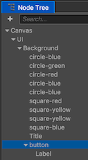
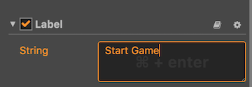

## Creating a play buton
In the previous steps, we created a background, a game title and added some Sprites to make it look more interesting. Next, we need to add a button. When the button is pressed, we need to load the `Scene` object that holds the logiv for our game.

### Adding a Play button
Adding a button, or adding *button like* functionality can be done in several ways. You can use a __Button__ node from the __Node Library__ panel. You can use a `Sprite` and make it act like button. Both are find ways to achieve our goal. For this example, let's use a __Button__ node from the __Node Library__ panel.

  

* First, from the __Node Library__ panel, drag and drop a __Button__  on to the __Background__ node in the __Node Tree__ panel.

    

* Second, rename the label to __Play__ in the __Node Tree__ panel.

* Third, change the __Label__ of the __Play__ button to __Start Game__.

    

* Last, with __Play__ selected, change some properites for the button. This should include __position__, __size__, __color__, etc. Make it look how you wish. I stuck with the default properties for the purpose of this demo.

### Making the Play button work
Now that we have a button, we need to make it run code when we click it.

__Task:__ Now is a good time to save your project! From the __File__ menu, select __Save Scene__ or use your operating systems shortcut key.
